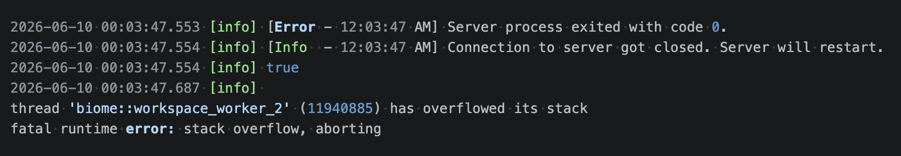

# Biome stack overflow on type inference

Biome 2.4.16 crashes with a stack overflow when type inference runs over
`react-dom.production.min.js`. The crash happens in both the CLI and the
language server.

Not present on Biome 2.4.11.

## Fix

Keep large minified/bundled JS out of Biome's type-aware scan. In our project it
was Storybook's build output:

```jsonc
// biome.json
{ "files": { "includes": ["**", "!**/storybook-static"] } }
```

More generally, exclude whatever vendored or bundled file is being type-inferred.
The repro's own `biome.json` intentionally keeps the file in scope to trigger the crash.

## Where it surfaced



In VS Code, through the Biome extension (`biomejs.biome`), which runs
`biome lsp-proxy`. The crashing file was `react-dom@18.3.1`'s production build,
which Storybook (9.1.13) had bundled into its manager runtime at
`storybook-static/sb-manager/globals-runtime.js`.

Those Storybook files are untracked build output, never committed to the repo.
Biome's language-server scan walks files on disk regardless of git status, so it
scanned and crashed on them anyway.

The bundling is incidental: the raw npm file reproduces on its own, so this repro
uses it directly.

## Reproduce

### Raw CLI

```sh
npm install
npm run biome -- lint react-dom.production.min.js
```

The crash prints to stderr but the process exits 0 — the worker thread overflows
without propagating to the main process:

```
thread 'biome::workspace_worker_0' has overflowed its stack
fatal runtime error: stack overflow, aborting
$ echo $?
0
```

### Script (CLI)

```sh
npm install
npm run repro:cli
```

Same as above but wraps the command, reads stderr, and exits 1 on crash — useful
for CI or scripted checks where exit 0 would otherwise hide the failure.

### Full (LSP)

```sh
npm install
npm run repro
```

Starts `biome lsp-proxy`, sends the LSP init sequence, opens a file to kick off
the workspace scan, and watches for the server to overflow its stack.

## The file

`react-dom.production.min.js` is committed verbatim from the npm package
`react-dom@18.3.1` (`react-dom/cjs/react-dom.production.min.js`), 131 KB, used
whole and unmodified. Also viewable at
<https://unpkg.com/react-dom@18.3.1/cjs/react-dom.production.min.js>.

## What crashes

Having `nursery/useAwaitThenable` in scope forces type inference on the file,
which recurses too deeply into the minified AST and overflows the thread stack.
Without it, the file lints fine.

## Notes

- The crash is in the type inference pass, not the parser. Without
  `nursery/useAwaitThenable`, both CLI and LSP handle the file without crashing.
- The LSP trigger file is irrelevant. Opening any file kicks off the workspace
  scan; the crash happens when that scan reaches `react-dom.production.min.js`.

Verified on macOS arm64, Node 20.19. Crashes on Biome 2.4.16, does not crash on
2.4.11. The LSP harness uses `pkill`; on Windows that needs adjusting.
